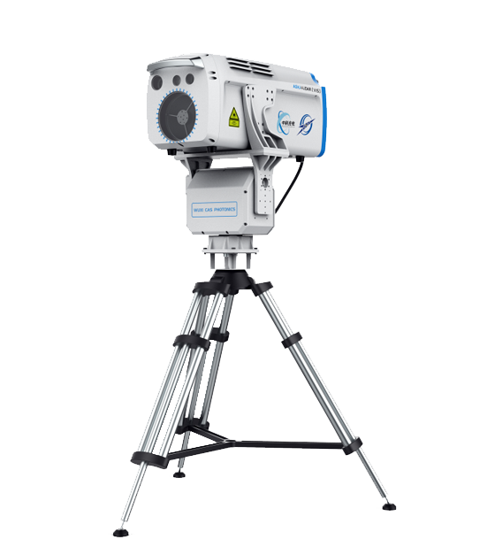
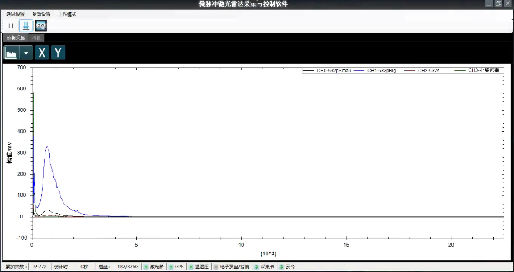
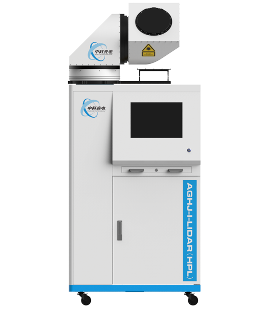

# 
中科光电上位机软件操作说明
版次|发布或更改内容|发布说明或修改原因|编制/日期|审核/日期|批准/日期
---|:--:|:--:|---|:--:|:--:|
v1.0|新版|功能说明|2022年4月14日|2022年4月14日|2022年4月14日
 | |

### 
微脉冲雷达

1. 主界面 

2. 软件操作 
	* 参数配置
	   * 硬件参数配置
	   * 系统参数设置
	* 采集模式设置
	* 开始采集
	* 关闭软件
	
3. 常见问题排查 
***
### 
高能扫描雷达

2. 软件操作 
	* 参数配置
	* 采集模式设置
	* 开始采集
	* 关闭软件
***	
### 
臭氧雷达
### 
三波长雷达
### 
能见度雷达

