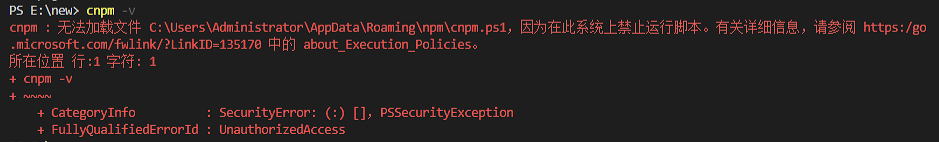

# docsify 教程
[docsify官网](https://docsify.js.org/)  
## 创建docsify
1. 安装nodejs。  
安装包下载地址：[nodejs 安装包地址](https://nodejs.org/zh-cn/download/) 
> nodejs 自带npm指令  
2. 打开powershell工具，查看版本信息：
> npm -v  

	查看nodejs版本：  

	> node -v  
  
3. 安装docsify  
> npm i docsify-cli -g  

	安装完成后，查看版本信息：  
	
> docsify -v

 **Ps**
> cnpm报错 : 无法加载文件 C:\Users\Administrator\AppData\Roaming\npm\cnpm.ps1，因为在此系统上禁止运行脚本  
>>   

> 解决方法：
>> 1. 以管理员身份运行power shell  
>> 2. 输入set-ExecutionPolicy RemoteSigned  
>>   

4. 初始化项目 
进入指定文件夹
> cd E:\docsifyDocs   
 
执行初始化指令： 

	> docsify init ./docs

	> 会自动在E:\docsifyDocs路径下创建docs文件夹，包含生成3个文件  
>> .nojekyll  
>> index.html  
>> README.md

启动：
> docsify serve docs

5. 参照docsify官网操作

## 部署至github

## Notpad++ 安装markdown插件
1. 下载插件
https://github.com/nea/MarkdownViewerPlusPlus/releases
2. 安装插件
> setting->import->import plugins  

	选择markdown插件安装即可

3. 使用markdown插件
> plugins->markdownview++

## markdown语法
简书教程：https://www.jianshu.com/p/191d1e21f7ed

