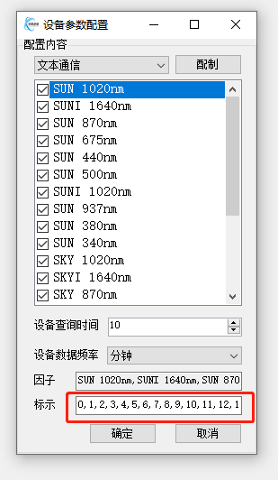
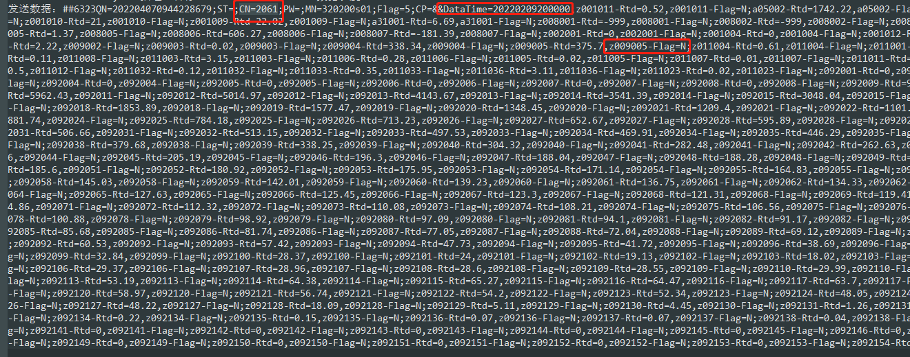
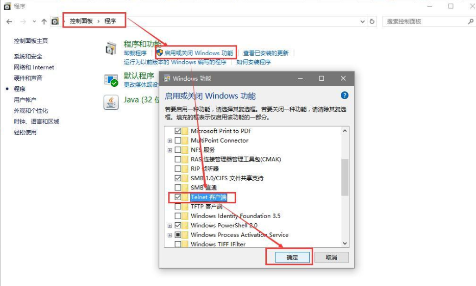

# 
数采系统
## 操作说明  
...  
***
## 故障排查分析
1. 数据延迟
	* 文件读取
		 1. 查看Debug.log文件，获取该事件节点下问题设备读取的文件路径。  
		 
		 2. 打开该文件路径，查看文件内容。一般情况下，设备会读取文件最后一行数据。查看该行数据内时间表达式。
		 3. 若该行数据时间与数采一致，或者按照协议要求，进行时间换算后，与数采一致。则数采采集无问题，考虑文件更新时间是否延迟；
		 4. 若时间不一致，重启数采或重新配置设备文件路径；
	* 串口通信
		 1. 查看Debug.log文件，获取该串口最新接收到的一条数据；
		 2. 将接收到的16进制数据转成字符串，若转换后的字符串可读，查看是否存在时间表达式；若转换后的字符串不可读，则参照设备协议进行判断。
		 3. 若串口未接收到数据，则检查设备发送问题；
	* 网口通信
	     1. 查看Debug.log文件，获取该IP地址最新接收到的一条数据；
		 2.将接收到的16进制数据转成字符串，若转换后的字符串可读，查看是否存在时间表达式；若转换后的字符串不可读，则参照设备协议进行判断。
		 3. 若该IP地址未接收到数据，检查设备发送问题;
2. 数据中断
	* 文件读取
	     1. 查看Debug.log文件，获取该设备最新读取的文件路径；
		 2. 查看是否存在该文件；
		 3. 若文件不存在，打开Error.log文件，查看驱动具体读取的文件路径并检查设备； 
			
		 4. 若文件存在，查看文件最新的数据是否和数采上显示的一致；若一致，则确认设备是否未更新数据；若不一致，则将问题提交质量；
	* 串口通信
		 1. 打开串口调试助手，关闭数采软件，在串口助手上配置串口参数（同数采一致）。点击连接串口；
		 2. 若连接成功，在串口助手上发送查询命令（命令可以在debug.log下查看）；  
			
		   若设备返回数据，将接收到的16进制数据转成字符串，看返回是否有时间戳，并确认时间是否与数采显示的时间一致; 若一致，则确认是否设备未更新数据，否则，重启数采系统。 
		   若设备未返回数据，则确认设备是否正常；
		 3. 若出现串口打开失败、无数据返回或返回数据不能进行有效的转化问题，请检查设备；

	* 网口通信
	     打开TCP调试助手， 配置TCPClink,并配置设备IP地址及端口；打开通信；  
		 ...  
		 以下，同串口通信。
	* TCPServer
		 1. 打开TCP调试助手， 配置TCPServer并配置相应的IP地址及端口；打开通信；
		 2. 若连接成功，等待接收数据； 
		 3. 若接收到设备发送的数据，将接收到的16进制数据转成字符串，看返回是否有时间戳，并确认时间是否与数采显示的时间一致;  
		    若一致，则确认是否设备未更新数据，否则，重启数采系统。  
			若设备未返回数据，则确认设备是否正常；
3. 数据错位  
	如下图，根据正确的顺序，修改红框中因子对应的序号。 
	例：SUN 1020nm和SUNI 1640nm采集数据交换，可以将红框中0和1互换。    
	  
4. 平台数据缺失  
	1. 查看通道是否开启，若未开启，请开启通道使用；若开始失败，参考“2.通道启用失败”操作指导；
	2. 通道开启后，查看平台通道配置是否正确；查看通道内因子是否配置，及配置编码是否正确；
	3. 查看Info.log下CN=2061（小时）报文中是否发送所配置因子的信息  
	  
	若未发送，重复1>2>步骤；若发送，查看是否接收到平台回复  
	  
	请平台同事帮忙解决；
	4. 打开TCP助手，配置平台信息，在log中复制报文，并通过工具发送，配合平台同事进行错误排查；
5. 通道启用失败  
	1. 打开TCP助手。配置通道，查看是否可以连接成功；
	2. 根据以下步骤，开启telnet  
	  
	3. 打开cmd，输入telnet ip地址 端口号 例如 telnet 192.168.1.1 8081，查看ip和端口是否可以监听。若不能监听，表示该工控机不能有效连接到平台，请找网络工程师解决；
